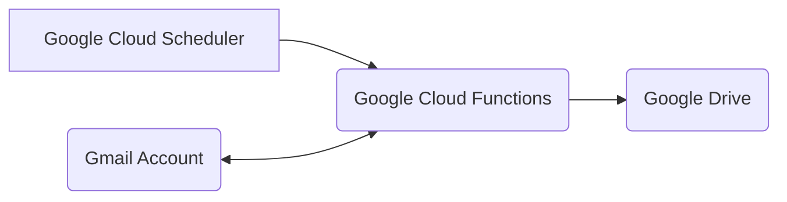

# Intro

This application reads through the Inbox of a Google email, downloads the attachments and put them in a Google Drive along with other info (From, Subject, etc).

# Architecture



# Release / Deployment
It is automatically deployed to Google Cloud Functions on push to main branch.

Deployed Cloud Function URL: https://asia-south1-earnest-triumph-390509.cloudfunctions.net/email-processor

# Github Secrets / Env variables
Setup the correct github secrets to be used as environment variables by the cloud function
  1. **WATCH_EMAIL**: Email id to fetch emails from
  2. **WATCH_PASSWORD**: Password of the email id
  3. **GOOGLE_DRIVE_FOLDER_ID**: Id of the folder in drive shared with the GCP project's Service Account
  4. **GOOGLE_SERVICE_ACCOUNT**: Json of the key generated for the GCP default project's Service Account

# One-off prerequisites
1. Google/Gmail:
    * Enable imap in gmail `Forwarding and POP/IMAP` setting (used in the secrets above)
    * Setup 2 factor auth for the google account
    * Setup app password (used in the secrets above)
2. Google Cloud:
    * Create a Service Account (SA) to let Github impersonate and deploy to Cloud Functions
    * Add roles `Cloud Functions Admin` and `Service Account User` to the SA
    * Create another principal with Workload Identity User role in the SA
        ```
        gcloud iam service-accounts add-iam-policy-binding "github-oidc@earnest-triumph-390509.iam.gserviceaccount.com" --project="earnest-triumph-390509" --role="roles/iam.workloadIdentityUser" --member="principalSet://iam.googleapis.com/projects/198262807868/locations/global/workloadIdentityPools/prath-pool/attribute.repository/prath-ventures/email-processor"
        ```
    * Create a workload identity pool and provider with details:
        * Issuer URL: https://token.actions.githubusercontent.com
        * Audience: Default
        * Attribute mapping:
            * attribute.aud => assertion.aud
            * attribute.actor => assertion.actor
            * attribute.repository => assertion.repository
            * google.subject => assertion.sub
3. Google Cloud Project's default SA:
    * Create a JSON key (used in the secrets above)
4. Google Drive:
    * Create a folder in your desired Google Drive
    * Share the folder with the default SA's email id with full access
    * Copy the folder's id from the url (used in the secrets above)
5. Google Cloud Scheduler:
    * Create a cloud scheduler to call the Cloud Function at intervals (currently set to every 2 hours)